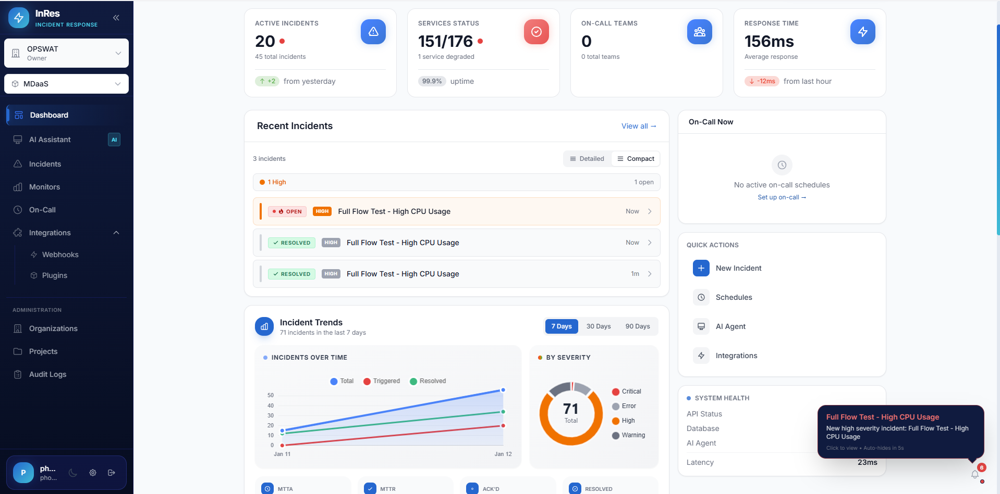
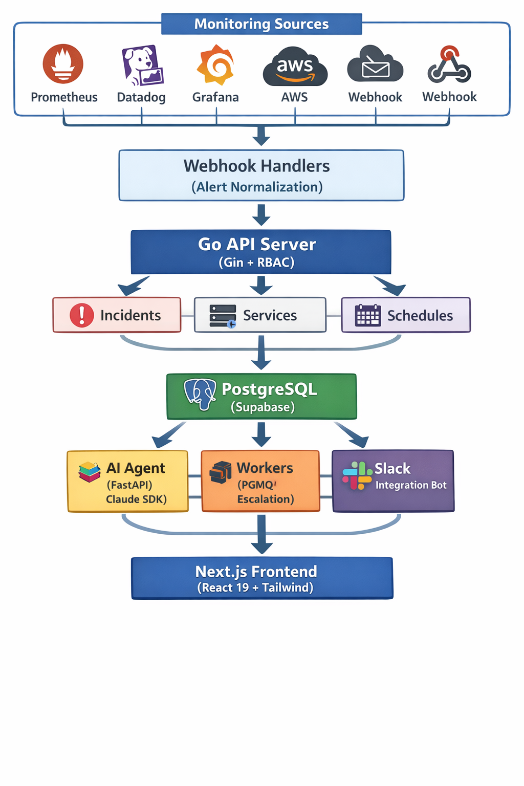

# ⚡ InRes — Intelligent Incident Response

**AI-Native On-Call & Incident Management Platform**

[](https://www.gnu.org/licenses/agpl-3.0)
[](https://go.dev)
[](https://nextjs.org)
[](https://python.org)

> 💡 *Inspired by [inres](https://github.com/inresOps/inres) — Smart Live Alert & Response*

---

<p align="center">
  
</p>

## 🎯 What is InRes?

InRes is an **open-source, AI-native incident response platform** that goes beyond simple alerting. It combines traditional on-call features with an autonomous AI agent that can investigate, diagnose, and remediate issues — all under your guidance with human-in-the-loop approval workflows.

---

## ✨ Current Features

### 🚨 Incident Management
| Feature | Description |
|---------|-------------|
| **Full Lifecycle** | Triggered → Acknowledged → Resolved with complete audit trail |
| **Severity Levels** | Critical, High, Medium, Low with visual indicators |
| **Priority Mapping** | P1-P5 priority system compatible with Datadog/PagerDuty |
| **Smart Deduplication** | Alert fingerprinting prevents duplicate incidents |
| **Auto-Resolution** | Incidents auto-resolve when monitoring tools send recovery alerts |
| **Real-time Dashboard** | Live incident feed with filtering and search |
| **Incident Analytics** | AI-powered incident insights and pattern detection |

### 📅 On-Call Scheduling
| Feature | Description |
|---------|-------------|
| **Visual Timeline** | Interactive schedule visualization |
| **Rotation Management** | Create and manage on-call rotations |
| **Schedule Overrides** | Temporary schedule adjustments for vacations, swaps |
| **Groups & Teams** | Organize responders into logical units |
| **Who's On-Call** | Instant lookup for current on-call engineer |

### 📈 Escalation Policies
| Feature | Description |
|---------|-------------|
| **Multi-level Escalation** | Define escalation chains with time-based triggers |
| **Auto-Assignment** | Automatically assign incidents based on escalation policy |
| **PGMQ Workers** | Reliable async escalation processing with PostgreSQL Message Queue |

### 🤖 AI-Powered (Claude Agent)
| Feature | Description |
|---------|-------------|
| **Real-time Chat** | WebSocket-based AI assistant for incident investigation |
| **MCP Integration** | Model Context Protocol for extensible tool capabilities |
| **Tool Approval System** | Human-in-the-loop for sensitive operations |
| **Memory Persistence** | Context-aware conversations across sessions |
| **Custom Skills** | Upload and manage AI skills via marketplace |
| **Incident Analysis** | AI-generated insights and root cause suggestions |
| **Audit Logging** | Complete audit trail of AI actions |

### 🔌 Integrations

#### Monitoring & Alerting
| Integration | Status | Features |
|------------|--------|----------|
| **Prometheus/AlertManager** | ✅ Supported | Native webhook, severity mapping, fingerprint deduplication |
| **Datadog** | ✅ Supported | P1-P5 priority mapping, auto-resolution on recovery |
| **Grafana** | ✅ Supported | State-based severity, dashboard linking |
| **AWS CloudWatch** | ✅ Supported | SNS integration, alarm state mapping |
| **PagerDuty** | ✅ Supported | Incident sync, urgency mapping |
| **Coralogix** | ✅ Supported | Log-based alerts, application/subsystem tagging |
| **Generic Webhook** | ✅ Supported | Custom JSON payload support |

#### Uptime Monitoring Sources
| Integration | Status | Features |
|------------|--------|----------|
| **UptimeRobot** | ✅ Supported | Webhook integration, status sync |
| **Cloudflare Workers** | ✅ Supported | Edge-based health checks, global monitoring |
| **Checkly** | ✅ Supported | Synthetic monitoring, API checks |

#### Communication
| Integration | Status | Features |
|------------|--------|----------|
| **Slack** | ✅ Supported | Interactive notifications, incident actions from Slack |

### 🏢 Multi-Tenancy & Authorization
| Feature | Description |
|---------|-------------|
| **Organizations** | Full multi-tenant isolation |
| **Projects** | Organize resources within organizations |
| **ReBAC** | Relationship-Based Access Control for fine-grained permissions |
| **Roles** | Owner, Admin, Member, Viewer with hierarchical inheritance |
| **JWT Auth** | Supabase Auth integration with secure token verification |

### 📊 Uptime Monitoring
| Feature | Description |
|---------|-------------|
| **HTTP/HTTPS Checks** | Monitor endpoint availability with configurable intervals |
| **Response Time Tracking** | Track and alert on slow responses (>5s threshold) |
| **SSL Certificate Monitoring** | Automatic SSL expiry alerts (30-day warning) |
| **Uptime Statistics** | 1h, 24h, 7d, 30d uptime percentages and metrics |
| **Auto-Incident Creation** | Automatically creates incidents on downtime detection |
| **Service Dashboard** | Real-time status overview with historical data |

### 🛠 Service Catalog
| Feature | Description |
|---------|-------------|
| **Service Registry** | Manage services with escalation policies |
| **Integration Mapping** | Connect integrations to services |
| **Routing Conditions** | Alert routing based on severity, labels, alertname |
| **Health Monitoring** | Integration heartbeat and health status |

---

## 🛠 Tech Stack

| Component | Technology |
|-----------|------------|
| **Backend API** | Go (Gin) + PostgreSQL |
| **AI Agent** | Python (FastAPI) + Claude SDK + MCP |
| **Frontend** | Next.js 15 + React 19 + Tailwind CSS |
| **Auth** | Supabase Auth + JWT |
| **Database** | Supabase (PostgreSQL) + PGMQ |
| **Workers** | Go (escalation) + Python (Slack) |

---

## 🏗 Architecture
<p align="center">
  
</p>


</details>

---

## 🚀 Quick Start

### Prerequisites
- Docker & Docker Compose
- Anthropic API key (for AI features)
- Supabase project (or local Supabase)

### Docker Compose (Recommended)

```bash
# Clone the repository
git clone https://github.com/phonginreallife/InRes.git
cd InRes

# Setup configuration
mkdir -p ../inres-project
cp -r deploy/docker ../inres-project/
cp ../inres-project/docker/volumes/config/cfg.ex.yaml \
   ../inres-project/docker/volumes/config/dev.config.yaml

# Configure environment
cat > ../inres-project/docker/.env << 'EOF'
ANTHROPIC_API_KEY=your-anthropic-api-key
SUPABASE_URL=your-supabase-url
SUPABASE_ANON_KEY=your-supabase-anon-key
SUPABASE_SERVICE_ROLE_KEY=your-service-role-key
SUPABASE_JWT_SECRET=your-jwt-secret
DATABASE_URL=postgresql://postgres:postgres@db:5432/postgres
EOF

# Start all services
cd ../inres-project/docker
docker compose up -d
```

**Access:** http://localhost:8080

### Kubernetes (Helm)

```bash
# Clone & setup
git clone https://github.com/phonginreallife/InRes.git
cp -r InRes/deploy/helm ./inres-helm
cd inres-helm/inres

# Create secrets
kubectl create secret generic inres-config --from-file=config.yaml

# Deploy
helm install inres . -f values.yaml
```

See [Helm docs](deploy/helm/inres/README.md) for advanced configuration.

---

## 🔧 Development

### Backend (Go API)
```bash
cd api

# Install air for hot reload
go install github.com/cosmtrek/air@latest

# Run with hot reload
air

# Or run directly
go run cmd/server/main.go
# Runs on http://localhost:8080
```

### AI Agent (Python)
```bash
cd api/ai

# Create virtual environment
python3 -m venv venv
source venv/bin/activate

# Install dependencies
pip install -r requirements.txt

# Run AI agent
export inres_CONFIG_PATH=../cmd/server/dev.config.yaml
python claude_agent_api_v1.py
# Runs on http://localhost:8002
```

### Frontend (Next.js)
```bash
cd frontend/inres

# Install dependencies
npm install

# Run development server
npm run dev
# Runs on http://localhost:3000
```

### Database Migrations
```bash
cd supabase

# Link to Supabase project
supabase link

# Push migrations
supabase db push
```

---

## 🔗 Webhook Endpoints

### Integration Webhook URLs

| Integration | Webhook URL |
|------------|-------------|
| Prometheus | `POST /webhook/prometheus/{integration_id}` |
| Datadog | `POST /webhook/datadog/{integration_id}` |
| Grafana | `POST /webhook/grafana/{integration_id}` |
| AWS CloudWatch | `POST /webhook/aws/{integration_id}` |
| PagerDuty | `POST /webhook/pagerduty/{integration_id}` |
| Coralogix | `POST /webhook/coralogix/{integration_id}` |
| Generic | `POST /webhook/webhook/{integration_id}` |

### Example: Prometheus AlertManager Configuration

```yaml
# alertmanager.yml
receivers:
  - name: 'inres'
    webhook_configs:
      - url: 'https://your-inres-domain/webhook/prometheus/YOUR_INTEGRATION_ID'
        send_resolved: true

route:
  receiver: 'inres'
  group_by: ['alertname', 'instance']
  group_wait: 10s
  group_interval: 10s
  repeat_interval: 1h
```

---

## 📋 API Overview

### Core Endpoints

| Method | Endpoint | Description |
|--------|----------|-------------|
| **Incidents** |||
| GET | `/api/incidents` | List incidents (with ReBAC filtering) |
| POST | `/api/incidents` | Create incident |
| GET | `/api/incidents/:id` | Get incident details |
| PUT | `/api/incidents/:id/acknowledge` | Acknowledge incident |
| PUT | `/api/incidents/:id/resolve` | Resolve incident |
| **Schedules** |||
| GET | `/api/schedules` | List schedules |
| GET | `/api/schedules/timeline` | Get schedule timeline |
| POST | `/api/overrides` | Create schedule override |
| **Integrations** |||
| GET | `/api/integrations` | List integrations |
| POST | `/api/integrations` | Create integration |
| GET | `/api/integrations/health` | Get integration health |
| **Uptime Monitoring** |||
| GET | `/api/uptime/services` | List monitored services |
| POST | `/api/uptime/services` | Create monitored service |
| GET | `/api/uptime/services/:id` | Get service details |
| POST | `/api/uptime/services/:id/check` | Trigger manual check |
| GET | `/api/uptime/services/:id/stats` | Get uptime statistics |
| GET | `/api/uptime/services/:id/history` | Get check history |
| GET | `/api/uptime/dashboard` | Get uptime dashboard |
| **Organizations** |||
| GET | `/api/orgs` | List user organizations |
| POST | `/api/orgs` | Create organization |
| GET | `/api/orgs/:id/members` | List organization members |
| **Projects** |||
| GET | `/api/projects` | List user projects |
| POST | `/api/projects` | Create project |

### AI Agent Endpoints

| Method | Endpoint | Description |
|--------|----------|-------------|
| WS | `/ws/chat` | WebSocket for AI chat |
| GET | `/conversations` | List conversations |
| POST | `/conversations` | Create conversation |
| GET | `/mcp/servers` | List MCP servers |
| POST | `/mcp/servers` | Add MCP server |

---

## 🔐 Security Features

- **JWT Verification** — Supabase Auth with secure token validation
- **ReBAC** — Relationship-Based Access Control for tenant isolation
- **AI Tool Approval** — Human-in-the-loop for sensitive AI actions
- **Rate Limiting** — Configurable rate limits on AI endpoints
- **CORS** — Configurable allowed origins
- **Audit Logging** — Complete trail of actions and AI tool usage
- **Parameterized Queries** — SQL injection protection

---

## 📈 Roadmap

- [x] Core incident management
- [x] On-call scheduling with overrides
- [x] Multi-level escalation policies
- [x] AI-powered incident assistant
- [x] Monitoring integrations (Prometheus, Datadog, Grafana, AWS, etc.)
- [x] Slack integration
- [x] Multi-tenant organizations
- [x] ReBAC authorization
- [x] Uptime monitoring with SSL tracking
- [ ] Advanced routing rules (regex, CEL)
- [ ] Runbook automation
- [ ] Mobile app (iOS/Android)
- [ ] Status page integration
- [ ] Post-mortem templates

---

## 🤝 Contributing

We welcome contributions! Please see our [Contributing Guide](CONTRIBUTING.md) for details.

1. Fork the repository
2. Create a feature branch (`git checkout -b feature/amazing-feature`)
3. Commit your changes (`git commit -m 'Add amazing feature'`)
4. Push to the branch (`git push origin feature/amazing-feature`)
5. Open a Pull Request

---

## 📄 License

[AGPLv3](LICENSE) — Self-host freely, customize as needed, no vendor lock-in.

---

## 🙏 Acknowledgements

- [inres](https://github.com/inresOps/inres) — Original inspiration
- [Anthropic Claude](https://anthropic.com) — AI capabilities
- [Supabase](https://supabase.com) — Auth & Database
- [Gin](https://gin-gonic.com) — Go HTTP framework
- [Next.js](https://nextjs.org) — React framework

---

<p align="center">
  <b>Built with ❤️ for SREs and DevOps teams</b>
</p>
